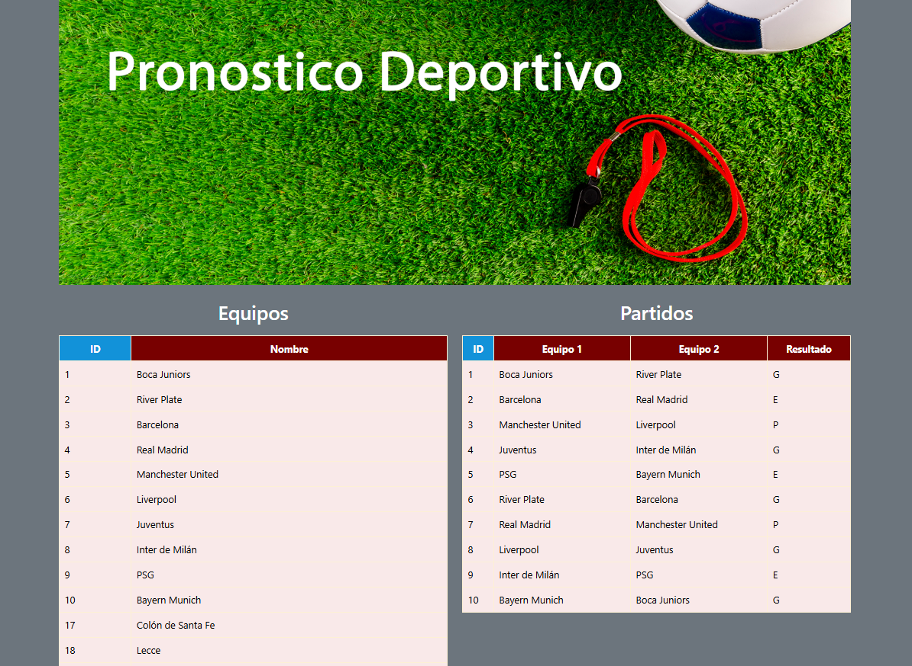

# ⚽ Pronósticos Deportivos

**Pronósticos Deportivos** es una aplicación desarrollada en **Spring Boot** que permite gestionar equipos, partidos y pronósticos en un sistema de predicciones deportivas.

---

## 🚀 Características

✔ CRUD completo de **Equipos, Partidos, Participantes y Pronósticos**  
✔ Base de datos **MySQL** con **Spring Data JPA**  
✔ **Interfaz gráfica** con **Thymeleaf y Bootstrap**  
✔ Validaciones de datos y relaciones en la base de datos  
✔ API REST probada con **Insomnia**

---

## 🛠 Tecnologías Utilizadas

- **Java 17**
- **Spring Boot**
- **Spring Data JPA**
- **MySQL**
- **Thymeleaf**
- **Bootstrap**
- **Maven**

---

## 🏗 Instalación y Uso

1. **Clonar el repositorio**
   ```bash
   git clone https://github.com/tu-usuario/pronosticos-deportivos.git
   cd pronosticos-deportivos
   ```

2. **Configurar la base de datos**
   - Crea una base de datos MySQL llamada `pronosticos_deportivos`.
   - Configura las credenciales en `application.properties` o `application.yml`.

3. **Ejecutar la aplicación**
   ```bash
   mvn spring-boot:run
   ```

4. **Acceder a la interfaz gráfica**
   - Abre [http://localhost:8080](http://localhost:8080) en tu navegador.

---

## 📷 Capturas de Pantalla

A continuación te mostramos cómo se ve la aplicación:



---

## 💡 Contribuciones

Las contribuciones son bienvenidas. Si deseas mejorar el proyecto o agregar nuevas funcionalidades, sigue estos pasos:

1. **Haz un Fork** del repositorio.
2. Crea una nueva rama con una descripción clara:
   ```bash
   git checkout -b nueva-funcionalidad
   ```
3. Realiza tus cambios y haz un commit:
   ```bash
   git commit -m "Agrega nueva funcionalidad X"
   ```
4. Sube los cambios a tu repositorio remoto:
   ```bash
   git push origin nueva-funcionalidad
   ```
5. Crea un **Pull Request** en este repositorio.

---

## 📬 Contacto

Si tienes alguna duda o sugerencia, puedes contactarme a través de GitHub:

[GitHub: SonyGahan](https://github.com/SonyGahan)

---

## 📝 Licencia

Este proyecto está bajo la **Licencia MIT**. Consulta el archivo [LICENSE](LICENSE) para más detalles.

---

## 💻 Agradecimientos

🚀 Gracias por visitar mi repositorio y por tu interés en este proyecto. ¡Espero que te sea útil! 😄

## ⌨️ Construido con ❤️ por Sonia Pereira 😊

